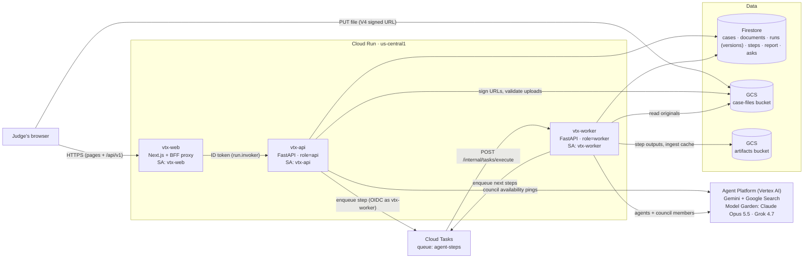
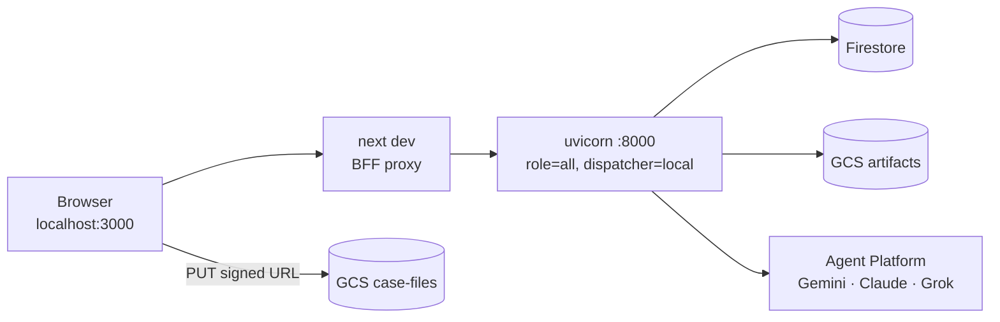
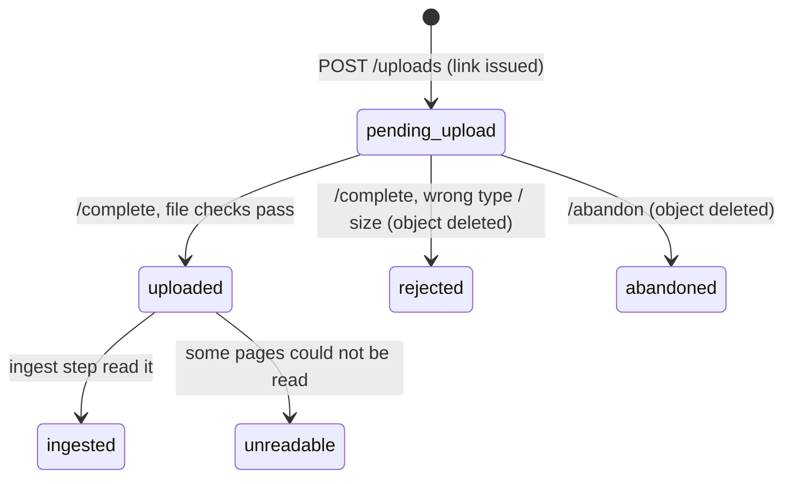
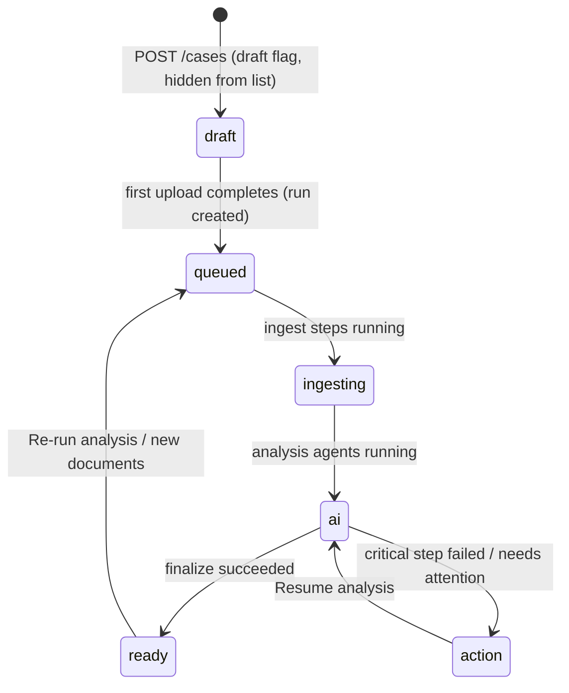
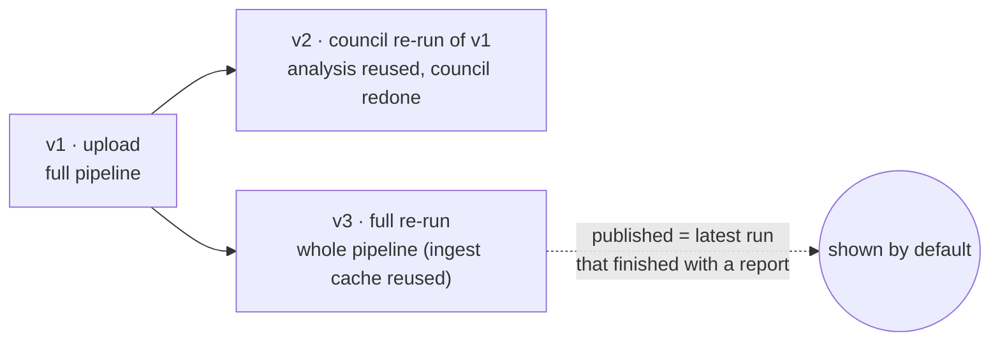
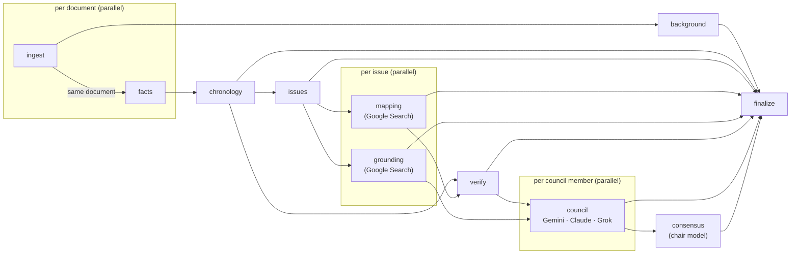
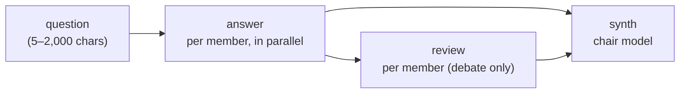
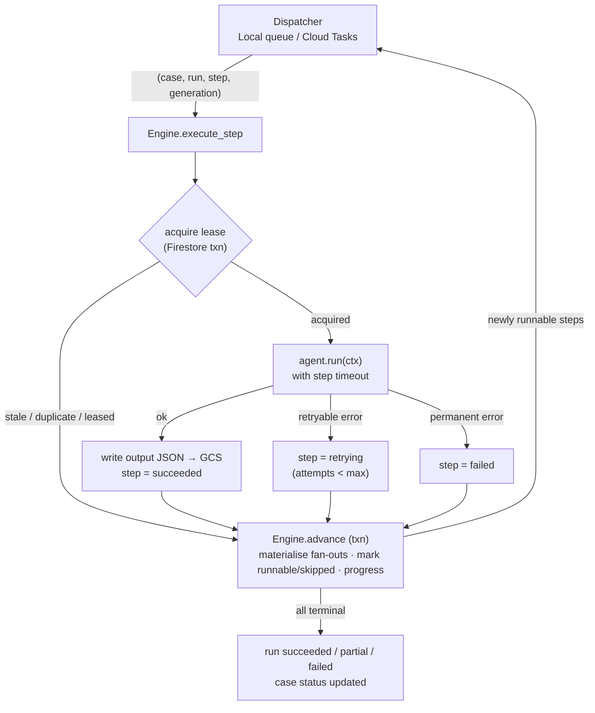
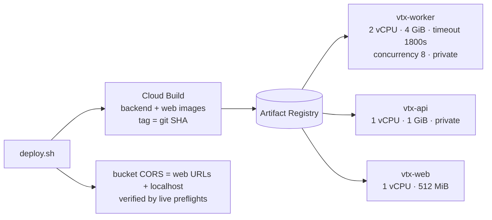

# VeriteLex AI

Case analysis for DIFC Courts judges. A judge uploads the case record. A multi-agent pipeline on Google Cloud then reads every document and produces:
- the background of the matter
- a dated chronology of facts
- the legal issues
- the decisions each group of facts maps to
- the Google Search grounding behind the analysis
- a **model council** pre-analysis. Three models from different vendors (Gemini 3.1 Pro, Claude Opus 5.5, Grok 4.7, all served by Google Cloud) each read the record on their own. Their readings are then compared issue by issue, and the output includes the facts most likely to decide the case and questions for counsel.

The judge can also **ask the council** follow-up questions. Every analysis run is kept as a **version**: re-running never overwrites an earlier report, and the judge can switch between versions.

> [!NOTE]
> This is an internal **proof of concept**. Login is static (no real authentication), and external research is grounded with **Google Search only**. Other connectors are shown as disabled in the UI.

---

## Contents

1. [What works today](#1-what-works-today)
2. [Tech stack](#2-tech-stack)
3. [Repository layout](#3-repository-layout)
4. [System architecture](#4-system-architecture)
5. [End-to-end flows](#5-end-to-end-flows)
6. [Multi-agent pipeline](#6-multi-agent-pipeline)
7. [Agent harness (orchestration and resilience)](#7-agent-harness-orchestration-and-resilience)
8. [Data model](#8-data-model)
9. [REST API](#9-rest-api)
10. [Frontend](#10-frontend)
11. [Security](#11-security)
12. [Configuration](#12-configuration)
13. [Google Cloud resources and IAM](#13-google-cloud-resources-and-iam)
14. [Run locally](#14-run-locally)
15. [Deploy to Cloud Run](#15-deploy-to-cloud-run)
16. [Operations and troubleshooting](#16-operations-and-troubleshooting)
17. [Known limitations and roadmap](#17-known-limitations-and-roadmap)

---

## 1. What works today

| Area | Status |
|---|---|
| Static login | ✅ Static sign-in and code screens; "Verify and continue" goes to the case list (no real authentication) |
| Case list from Firestore | ✅ Live; polls while any case is processing |
| Upload documents | ✅ Uploads go from the browser straight to Cloud Storage via V4 signed URLs; references are stored on the case in Firestore |
| Multi-agent analysis | ✅ Starts automatically when the uploads complete; mixes parallel and sequential steps (see the DAG below) |
| Report: Background | ✅ Generated |
| Report: Dates and facts | ✅ Generated, with source citations and verification flags |
| Report: Mapped to decisions | ✅ Generated with Google Search; every link is checked over HTTP |
| Report: Legal issues | ✅ Generated |
| Report: Grounding | ✅ Generated; Google Search coverage per issue |
| Report: Documents | ✅ Live document list |
| Live progress | ✅ One tile per agent step while a run is in progress |
| Resume | ✅ Restarts a failed run from its checkpoint; succeeded steps are reused |
| Re-run and versions | ✅ **Full re-run** (the whole pipeline) or **council-only re-run** (reuses a version's analysis and re-runs only the council). Every run is stored as a version; a version switcher and an *Analysis versions* screen let the judge open any earlier report |
| Model council: pre-analysis | ✅ Gemini 3.1 Pro, Claude Opus 5.5 and Grok 4.7 each read the record; issue-by-issue votes, readings by model with checked citations, decisive facts |
| Model council: questions for counsel | ✅ Merged from all members, with who raised each one |
| Model council: ask the council | ✅ Free-text questions in three modes: independent, debate (members review each other) and steel-man; a chair model compares the answers |
| Council members in Model Garden | ⚠️ Gemini works out of the box. **Claude and Grok must be enabled once in Model Garden** (§13.1). Until they are, they show as *Not enabled* and the council runs with the members that are available |
| Submissions, Gaps | ⏳ Shown as "not yet available" (later release) |
| Connectors other than Google Search | ⏳ Disabled ("Coming soon") |

**Region:** `us-central1` · **GCP project:** `veritelex-ai-0pnts`

---

## 2. Tech stack

| Layer | Technology |
|---|---|
| Web | Next.js 16 (App Router, Turbopack), React 19, TypeScript, Tailwind CSS v4 |
| Web → API | Next.js route handler acting as a backend-for-frontend (BFF) proxy, `/api/v1/*` |
| API and agents | Python 3.13, FastAPI, Pydantic v2, `uv` |
| LLM | Gemini on Vertex AI via `google-genai` (`gemini-3.1-pro-preview` / `gemini-3.8-flash`, with fallbacks) |
| Model council | Gemini 3.1 Pro (`google-genai`), Claude Opus 5.5 (Anthropic Messages API via `rawPredict`) and Grok 4.7 (OpenAI-compatible chat completions), all on **Google Cloud Agent Platform (Vertex AI) Model Garden**, authenticated with ADC through `httpx` + `google-auth`. No third-party API keys |
| Grounding | Gemini built-in **Google Search** tool |
| Database | Cloud Firestore (Native mode, NoSQL) |
| Files | Cloud Storage: case files bucket and agent artifacts bucket |
| Orchestration | Custom DAG engine; in-process dispatcher locally, **Cloud Tasks** in the cloud |
| Hosting | Cloud Run (3 services); images built by Cloud Build and stored in Artifact Registry |

---

## 3. Repository layout

```
.
├── src/                          # Next.js app (frontend)
│   ├── app/
│   │   ├── (app)/cases/          # case list + /cases/[caseId]/[section] report
│   │   ├── (app)/upload/         # 3-step upload wizard
│   │   ├── (app)/settings/       # connectors / council / policy
│   │   ├── login/                # static login
│   │   └── api/v1/[...path]/     # BFF proxy → FastAPI
│   ├── components/               # screens; report/ = one component per report section
│   └── lib/
│       ├── api.ts                # typed API client, signed-URL PUT, usePoll hook
│       ├── store.tsx             # client UI state (connectors, models, toasts)
│       └── data.ts               # static UI metadata (sections, connectors, demo content)
├── Dockerfile                    # web image (Next.js standalone)
├── next.config.ts                # output: "standalone"
└── backend/
    ├── app/
    │   ├── main.py               # FastAPI app factory (role: api | worker | all)
    │   ├── config.py             # settings from VTX_* env vars
    │   ├── container.py          # composition root (wires repo, gcs, llm, engine, dispatcher)
    │   ├── api/routes.py         # public REST API (/api/v1)
    │   ├── internal/tasks.py     # Cloud Tasks target (/internal/tasks/execute), OIDC-verified
    │   ├── harness/              # agent harness
    │   │   ├── dag.py            #   pipeline + ask DAG definitions and dependency rules
    │   │   ├── engine.py         #   orchestrator: runs (full / council), asks, steps, leases, advance, resume
    │   │   ├── dispatcher.py     #   LocalDispatcher / CloudTasksDispatcher
    │   │   ├── llm.py            #   Gemini wrapper: schema validation, fallback, breaker, grounding
    │   │   ├── council.py        #   CouncilLLM: one facade over every council member (chains, limits, probes)
    │   │   ├── providers.py      #   REST clients for Claude (rawPredict) and Grok (OpenAI-compatible) on Vertex
    │   │   └── resilience.py     #   retry/backoff, circuit breaker, error taxonomy
    │   ├── agents/               # one module per agent + schemas, registry, URL checks
    │   │   ├── council.py        #   council member reading, consensus, council + questions sections
    │   │   ├── ask.py            #   ask the council: answer, review (debate), synthesis
    │   │   └── record.py         #   the record view council agents read + deterministic citation checks
    │   ├── ingest/               # text extraction (PDF/DOCX/XLSX/TXT/images), file-type sniffing
    │   ├── storage/              # Firestore repository, GCS wrapper
    │   └── domain/models.py      # API request/response models
    ├── tests/                    # unit tests (DAG rules, helpers, ingest, upload API state machine, council / versions / asks)
    ├── scripts/                  # synthetic sample case + end-to-end smoke test
    ├── infra/setup.sh            # one-time GCP foundation (idempotent)
    ├── infra/deploy.sh           # build + deploy to Cloud Run
    ├── infra/cors.sh             # case-files bucket CORS + live preflight check (used by both)
    └── Dockerfile                # backend image (same image for api and worker)
```

---

## 4. System architecture

### 4.1 Cloud (target deployment)



* **vtx-web** serves the UI. All API calls are same-origin (`/api/v1/*`), and the BFF route forwards them to `vtx-api` with a metadata-server **ID token**. The browser never talks to the API directly.
* **vtx-api** handles cases, uploads, runs (report versions), reports and council questions. It starts runs and asks and enqueues their first steps. It also pings each council model when the Settings screen checks availability.
* **vtx-worker** runs exactly one agent step per Cloud Tasks request. When a step finishes, it advances the DAG and enqueues whatever has become runnable.
* Each Cloud Run service uses one image and a role switch (`VTX_ROLE`), so the API and the worker scale independently.

### 4.2 Local development



Locally, a single FastAPI process serves the API **and** runs agent steps. A bounded in-process queue (`LocalDispatcher`) stands in for Cloud Tasks. Everything else is the real GCP service: Firestore, Cloud Storage and Vertex AI.

---

## 5. End-to-end flows

### 5.1 Upload, analysis, report

```mermaid
sequenceDiagram
    autonumber
    participant B as Browser (upload wizard)
    participant W as Web BFF
    participant A as API
    participant S as GCS case-files
    participant F as Firestore
    participant O as Orchestrator / workers

    B->>W: POST /api/v1/cases
    W->>A: forward
    A->>F: create case (draft, hidden from list)
    B->>A: POST /cases/{id}/uploads {files[]}
    A->>A: validate every file, then sign all URLs in parallel (IAM signBlob)
    A->>F: create all document records in one atomic batch (pending_upload)
    A-->>B: V4 signed PUT URLs (+ required headers)
    par up to 3 files at a time
        B->>S: CORS preflight (OPTIONS), then PUT file bytes with live progress
        B->>A: POST /documents/{docId}/complete
        A->>S: stat + read head (size, magic bytes); DOCX/XLSX: ranged read of the zip directory
        A->>F: pending_upload → uploaded (or → rejected, object deleted)
    end
    opt the judge skips or removes a file that failed
        B->>A: POST /documents/{docId}/abandon
        A->>F: pending_upload → abandoned (any landed bytes deleted)
    end
    A->>O: no upload still pending → start run (idempotent key)
    O->>F: run + steps created, case status → ingesting / ai
    loop until finished
        B->>A: GET /cases/{id} and /runs/latest (poll)
    end
    O->>F: report sections written, case → ready
    B->>A: GET /cases/{id}/report/{section}
```

**Upload step 2 (Confirm details).** The Background agent extracts the case fields: claim number, parties, division, case type and amount. The wizard polls until they arrive and lets the judge edit them. It then sends `PATCH {fields, confirmed: true}`. Once fields are confirmed, the agents never overwrite them.

### 5.2 Upload states, retries and CORS

Each document record moves through these states. Every move out of `pending_upload` is a Firestore compare-and-set transaction, so a late retry, a double click or a race between *complete* and *abandon* cannot flip a settled file.



* **The run starts when nothing is pending.** Every `/complete` and `/abandon` re-checks the batch. If the tab closed mid-batch, nothing is left to trigger the start, so reading the case does it instead: once the case has been idle past the link lifetime + 60 s (16 min), the next case-list refresh starts the run with the files that made it.
* **Abandoned records are hidden** from the document list and never analysed.
* **Per-file status in the wizard.** Each file shows *Preparing* (getting its link) → *Waiting* (for one of 3 upload slots) → *Uploading n%* (MB/s, time left) → *Checking* → *Uploaded ✓*, or *Failed* with the reason. Uploads use `XMLHttpRequest`, because `fetch` cannot report upload progress.
* **Automatic retries.** A PUT gets up to 3 attempts on network errors, 408, 429 and 5xx (each attempt restarts the file). The server check gets up to 4 attempts. An expired or invalid link is replaced with a new one on **Retry**. A refused file (wrong type, too large) cannot be retried; remove it or continue without it.
* **Continue without the failed files** abandons them, so the analysis starts with the files that made it. A browser warning stops the tab from closing while uploads are running.

> [!IMPORTANT]
> **Bucket CORS must allow both request headers the browser sends with the PUT: `Content-Type` and `x-goog-content-length-range`.** If one is missing, GCS answers the preflight with `200` but no `Access-Control-*` headers. The browser then blocks the PUT and reports only "Failed to fetch". [`infra/cors.sh`](backend/infra/cors.sh) applies the policy and replays a real preflight for every origin, and fails loudly if any origin is refused. `setup.sh` and `deploy.sh` both use it.

### 5.3 Case status lifecycle



Step statuses: `pending → queued → running → succeeded`. A step can also move to `retrying` and back to `queued`, or end as `failed` or `skipped`. A succeeded step can carry an `outcome` of `unavailable` (a council member not enabled in Model Garden) or `skipped`, and on council re-runs a `reused` flag (§5.4).

While a re-run is in progress the case shows `queued`/`ai` again, but **the previously published report stays readable** until the new run finishes.

### 5.4 Re-runs and report versions

Every analysis run is a **version** of the case report, numbered 1, 2, 3… in the order the runs started. A version's report is stored under its own run (`runs/{runId}/report/{section}`) and is **never overwritten**.



| Re-run | Request | What runs | Typical time |
|---|---|---|---|
| **Full re-run** | `POST /cases/{id}/runs {"mode":"full"}` | Every step. Text extraction and OCR come from the ingest cache (per document generation), so files are not re-read | ~10–15 min (sample case) |
| **Council-only re-run** | `POST /cases/{id}/runs {"mode":"council","sourceRunId":"r…"}` | Copies the source version's analysis steps (marked `reused`, their outputs are read from the source version's objects), then runs `council` → `consensus` → `finalize` | ~1 min |

* **Published version.** `GET /report/{section}` without `?run=` serves the *published* version: the latest run that finished with a report. A failed re-run leaves the previous version published. Any version is readable with `?run={runId}`.
* **Guards.** `POST /runs` returns `409` with a readable reason if a run is already in progress, or if a council re-run has no finished source version with issues. A double click collapses into one run (idempotency key).
* **Resume** applies to the latest run only. Older versions are read-only.
* **Older cases.** Reports written before versioning existed (`cases/{caseId}/report/{section}`) are served as version 1. They have no council section until a council re-run is made.
* **Asks** are grounded on a version too: by default the published one, or the version being viewed.

---

## 6. Multi-agent pipeline

The pipeline follows what the UI needs. Steps run in parallel when they are independent (per document, per issue). They run in sequence when an agent needs the output of an earlier one: chronology needs every document's facts, and mapping needs the issues.

### 6.1 DAG



The instance count is decided at runtime:
* `ingest` and `facts` get one instance per uploaded document.
* `mapping` and `grounding` get one instance per issue found by the `issues` agent.
* `council` gets one instance per configured council member (`council--gemini`, `council--claude`, `council--grok`), fixed when the run starts.

### 6.2 Agents

| Agent | Fan-out | Model tier | Google Search | Critical | Output → UI |
|---|---|---|---|---|---|
| **ingest** | per document | flash | – | no | Extracted text, page segments and OCR for scanned pages; document profile (type, filed by, date, summary) → *Documents* |
| **background** | – | pro | – | **yes** | Background paragraphs, key facts, case fields → *Background*, upload step 2 |
| **facts** | per document (same-key dependency on ingest) | flash | – | no | Dated facts with page citations, per document |
| **chronology** | – | pro | – | **yes** | Merged, de-duplicated chronology; who pleads what → *Dates and facts* |
| **issues** | – | pro | – | **yes** | Legal issues, each linked to the facts it relies on → *Legal issues* |
| **mapping** | per issue | pro | ✅ | no | Fact groups mapped to judgments/orders (court, date, relationship, how it applies, link) → *Mapped to decisions* |
| **grounding** | per issue | flash | ✅ | no | Coverage (full/partial/none), authorities found, queries and sources → *Grounding* |
| **verify** | – | flash | – | no | Checks that chronology entries are supported by the cited text; resolves every decision URL over HTTP and drops dead or unsupported links |
| **council** | per council member | each member's own model | – | no | The member's reading of every issue (what it turns on, confidence, citations), decisive facts, questions for counsel. Citations are checked against the record and the verified authorities in code |
| **consensus** | – | chair (first available member) | – | no | Groups the readings of each issue into at most two positions (reading A = majority) and merges facts and questions. It compares only; it adds no analysis |
| **finalize** | – | – | – | **yes** | Assembles the version's report sections (including `council` and `questions`), records the version summary on the run and publishes it |

If an optional step fails, the report degrades: that part is missing or marked. If a critical step fails, the run fails and the case shows **Resume analysis**.

### 6.3 Grounding with Google Search (two-phase)

When Gemini is asked for structured JSON output, it still runs Google searches but returns **no grounding sources**. Search-backed agents therefore make two calls:

1. **Research.** Prose with the Google Search tool. This captures the search queries, the sources (`grounding_chunks`) and the citation spans (`grounding_supports`).
2. **Structure.** No tools. The research notes, with inline `[n]` markers and a numbered source list, are turned into the agent's schema. The prompt allows external material only from those notes.

The sources returned to the agent come only from phase 1. `verify` then resolves each cited URL and keeps it only if it is reachable and matches a grounding source or its host.

### 6.4 Model council

Three models from different vendors read the same record **independently**, so the judge can see where they agree and where the issue genuinely divides. All three are served by Google Cloud Agent Platform and authenticated with Application Default Credentials.

| Member | Model chain (preferred first) | API on Agent Platform | Client-side limits |
|---|---|---|---|
| `gemini`: Gemini 3.1 Pro | `gemini-3.1-pro-preview` → `gemini-3.8-flash` → `gemini-2.5-pro` | `google-genai`, structured output | 3 concurrent calls |
| `claude`: Claude Opus 5.5 | `claude-opus-5-5` → `claude-sonnet-5-5` | `publishers/anthropic/models/{model}:rawPredict` (Messages API). The record is sent as a cached prompt block | 3 concurrent calls |
| `grok`: Grok 4.7 | `xai/grok-4.7` → `xai/grok-4.6` | `endpoints/openapi/chat/completions` (OpenAI-compatible), JSON mode | 2 concurrent, 10 req/min, 150k input / 14k output tokens per min. Prompt budget 360k characters (record plus brief), so on large cases it reads less of the record |

All three use the `global` endpoint. The members are configurable (`VTX_COUNCIL_MEMBERS`, §12).

**What each member reads.** The labelled case record (within the member's budget), the chronology, the issues, and for each issue only the authorities that passed `verify`. The Google Search notes are given as context only. Members never use their own web-search tools. They do not see each other's readings.

**Citations are checked in code, not by a model.** Record citations are matched against the record's citation index (document label plus page or paragraph). Authorities are matched against the verified authorities. Each citation is marked `verified` (found in the record or among the verified authorities), `warn` (an authority seen in the Google Search notes but not verified) or `bad` (not found).

**Consensus.** The chair (`gemini` → `claude` → `grok`, members that answered first) groups each issue's readings into at most two positions: reading A is the majority, reading B the main alternative. It also merges the flagged facts and questions, keeping who raised each. If only one member answered, no chair is needed. If the chair fails, the next member chairs. If nobody can compare, the section is published with `compared: false` and the UI shows each member's readings side by side. Model-written text refers to members as `{{m:<id>}}` tokens. The UI renders them through the anonymisation setting.

**A member that is not enabled** in Model Garden is recorded as `unavailable`, not as a failure. The council runs with the members that are available, and the section's `note` says who was missing.

### 6.5 Ask the council

Each question is a small durable run (id `q…`) on the same engine (leases, retries, Cloud Tasks), grounded on one report version and scoped to the whole record or a single issue.



| Mode | What the members do | What the chair returns |
|---|---|---|
| **Independent** | Each answers on its own, with citations | Summary, where they agree, where they differ |
| **Debate** | Each answers, then reviews the others' answers and gives a revised position | Same, after the review round |
| **Steel-man** | Each sets out the strongest case for the claimant and for the defendant | Merged points per side, with who made each |

*Left out* lists the citations that could not be verified. It is computed in code, not judged by a model. A case can have at most 3 asks running at once (`429` beyond that). The judge's question is passed as delimited data, never as instructions.

---

## 7. Agent harness (orchestration and resilience)

The harness gives the agents fault tolerance through checkpointing, idempotency, retries, fallbacks and graceful degradation. Agents themselves are plain `async run(ctx) -> AgentResult` classes.



| Concern | How it is handled |
|---|---|
| **Checkpointing** | Each step's state lives in Firestore (`runs/{runId}/steps/{stepId}`) and its output in GCS. Agents read upstream outputs through `ctx.outputs(spec)`. |
| **Exactly-once effect** | A step runs only under a transactional lease (`lease_owner`, `lease_until`) for its current `generation`. Duplicate or late deliveries (Cloud Tasks is at-least-once) are ignored and just call `advance`. |
| **Idempotent runs** | The run id comes from the idempotency key: `auto:` plus a hash of the documents and their generations. Concurrent auto-starts collapse into one run. |
| **Retries** | *Step level:* up to `max_attempts` (4; finalize 6) with exponential backoff and jitter. *Call level:* 3 attempts per Gemini call. Cloud Tasks adds its own redelivery (8 attempts, 5–300 s backoff). |
| **Timeouts** | Per-step timeout (`timeout_s` in the DAG) plus a per-call Gemini timeout. |
| **Model fallback** | Each tier has a chain: pro = `gemini-3.1-pro-preview → gemini-2.5-pro`; flash = `gemini-3.8-flash → gemini-3.7-flash → gemini-2.5-flash`. A model that returns 404 is skipped for the life of the process. Each council member has its own chain (§6.4). |
| **Council members** | Per member: fallback chain → availability memory (a model that answers 404/403 is skipped for `VTX_COUNCIL_UNAVAILABLE_TTL_S`, 10 min, then tried again, so enabling it in Model Garden needs no restart) → per-model circuit breaker → 3 attempts with full-jitter backoff that honours `Retry-After` on 429/503 (up to 60 s) → concurrency semaphore and a sliding-window limiter on requests and input/output tokens per minute, sized to the project's quota → JSON validated against the schema, with one repair round trip. A 403 for missing IAM permission or an org policy is reported as such, not as "enable it in Model Garden". Council steps are optional: 3 step attempts for `council`, 4 for `consensus`. |
| **Circuit breaker** | Per model: it opens after 4 consecutive failures and cools down for 60 s, so traffic goes to the next model in the chain. |
| **Structured output** | Pydantic schemas plus `response_schema`. One automatic repair round-trip when output fails validation; then `SchemaError`. |
| **Quota protection** | A process-wide Gemini concurrency cap (`llm_concurrency`), a bounded local dispatcher (`local_concurrency`), and bounded GCS I/O. |
| **Contention** | `advance` retries Firestore transaction aborts (up to 8×, with jitter). |
| **Stuck runs** | `reconcile()` re-dispatches steps whose lease expired or that went quiet (`stale_run_seconds`). It runs on API reads and on startup (`resume_active_runs`). |
| **Resume** | `POST …/runs/{runId}/resume`: a running run is force-reconciled. A failed or partial run gets `retry_failed()`, which resets failed and skipped steps and everything downstream, then re-runs only those. Succeeded steps are reused. |
| **Ingest cache** | Extraction output is cached per document generation (`cache/ingest/{case}/{doc}-{gen}.json`), so re-runs skip re-extraction and OCR. |
| **Large documents** | The source streams from GCS to a private scratch directory (CRC32C-verified, pinned to the generation validated at upload) and is parsed from disk on a dedicated thread pool, never on the event loop: a 1,000-page PDF stalls the loop for ~6 ms (2.5 s before). Page images are evicted from the PDF parser's cache after use, so parser memory stays near 10–15% of a scanned file's size. At most `VTX_OCR_MAX_INFLIGHT_BATCHES` OCR batches per document are in memory at once. |
| **Error taxonomy** | `RetryableStepError`, `PermanentStepError`, `SchemaError` and `UnavailableError` (a model the project cannot use: a configuration state, never retried; the step succeeds with `outcome: unavailable`). Each carries a separate `user_message` that the UI shows, without stack traces. |

---

## 8. Data model

### 8.1 Firestore (Native mode)

```
cases/{caseId}                               # c + 12 hex
  ├─ no, title, type, division, fields{}, confirmed, status, pct, note,
  │  latest_run_id, report_run_id (published version), report_ready_at, past, created_at, updated_at
  ├─ documents/{docId}                       # d + 12 hex
  │    name, kind, mime, size, generation, object (gs:// path), status, pages, label, ...
  │    status: pending_upload | uploaded | rejected | abandoned | ingested | unreadable (§5.2)
  ├─ runs/{runId}                            # r + 12 hex, derived from idem_key; one per report version
  │    idem_key, trigger (upload | manual | council), mode (full | council), source_run_id,
  │    council_models[], status, stage, pct, materialized[], created_at, finished_at,
  │    version summary written by finalize: report_ready_at, sections[], doc_count, counts{}, council[]
  │    ├─ steps/{stepId}                     # e.g. background, facts--{docId}, mapping--{n}, council--claude
  │    │    agent, key, deps[], critical, status, outcome, reused_from, attempts, max_attempts, generation,
  │    │    lease_owner, lease_until, output_uri, usage{}, error, user_error, timeout_s
  │    └─ report/{section}                   # this version's report, never overwritten:
  │         run_id, updated_at, json         # background | matrix | mapping | issues | tools | council | questions
  ├─ asks/{askId}                            # q + 12 hex: "Ask the council" runs, same engine
  │    question, mode, scope{kind, issue, label}, council_models[], source_run_id (version), status, ...
  │    └─ steps/{stepId}                     # answer--{member}, review--{member}, synth
  └─ report/{section}                        # legacy: reports written before versioning (served as version 1)
       run_id, updated_at, json
```

> [!NOTE]
> Report payloads are stored as a JSON string because Firestore does not allow nested arrays.

### 8.2 Cloud Storage

| Bucket | Object layout | Notes |
|---|---|---|
| `veritelex-ai-0pnts-case-files` | `cases/{caseId}/{docId}/{uuid}.{ext}` | Originals, uploaded by the browser. Private, uniform access, public-access prevention, **versioned**, 7-day soft delete. CORS: `PUT` only, from the known web origins only, allowing the `Content-Type` and `x-goog-content-length-range` headers (§5.2). |
| `veritelex-ai-0pnts-artifacts` | `cases/{caseId}/runs/{runId}/{stepId}.json` and `cache/ingest/{caseId}/{docId}-{generation}.json` | Agent step outputs and the ingest cache. Private. |

**Accepted file types:** PDF, DOCX, XLSX, TXT, PNG, JPG, TIFF. The type is sniffed from magic bytes and OOXML structure, not trusted from the file name. Files up to 500 MB each (`VTX_MAX_UPLOAD_BYTES`), 50 per batch.

---

## 9. REST API

Base path `/api/v1`. The browser calls it through the BFF at the same path on the web origin.

| Method | Path | Purpose |
|---|---|---|
| `GET` | `/cases` | Case list (drafts hidden) with status, progress and document counts. Also self-heals: reconciles stale runs, and starts the run for a batch whose last uploads expired |
| `POST` | `/cases` | Create a draft case |
| `GET` | `/cases/{caseId}` | Case detail (fields, status, latest run) |
| `PATCH` | `/cases/{caseId}` | Edit or confirm case fields (`{fields, confirmed}`) |
| `GET` | `/cases/{caseId}/documents` | Documents on file (cancelled uploads hidden) |
| `POST` | `/cases/{caseId}/uploads` | Request V4 signed PUT URLs for `{files:[{name,size,contentType}]}`. All files are validated first; records are created in one batch |
| `POST` | `/cases/{caseId}/documents/{docId}/complete` | Validate an uploaded file; auto-starts the run when nothing else is pending. Idempotent; `409` if the upload was cancelled |
| `POST` | `/cases/{caseId}/documents/{docId}/abandon` | Cancel an upload that failed (deletes any landed bytes); auto-starts the run if this was the last pending file. Idempotent; `409` if the file was already uploaded |
| `POST` | `/cases/{caseId}/runs` | Start a re-run: `{mode: "full" \| "council", sourceRunId?}` (§5.4). `202`; `409` with a reason if a run is in progress or a council re-run has no usable source |
| `GET` | `/cases/{caseId}/runs` | Every version, newest first: number, status, mode, trigger, source version, counts, documents, per-member council status, `published` |
| `GET` | `/cases/{caseId}/runs/latest` | Run status with per-step tiles |
| `GET` | `/cases/{caseId}/runs/{runId}` | One version's run status and steps (`outcome`, `reused`) |
| `POST` | `/cases/{caseId}/runs/{runId}/resume` | Resume from checkpoint (latest run only) |
| `GET` | `/cases/{caseId}/report/{section}?run={runId}` | `{runId, updatedAt, data}` for `background`, `matrix`, `mapping`, `issues`, `tools`, `council`, `questions`. Without `run`: the published version. `404` if that version has no such section |
| `GET` | `/council/models?refresh=1` | Council members with live availability (`ready`, `fallback`, `unavailable`, `error`, `unknown`), the model that answered, and a Model Garden link. Cached for 15 min; `refresh=1` pings each model again |
| `POST` | `/cases/{caseId}/asks` | Ask the council `{question, mode: independent \| debate \| steelman, scope, members?, runId?}`. `202`; `409` without a finished version, `422` invalid input, `429` if 3 asks are already running |
| `GET` | `/cases/{caseId}/asks` | Earlier questions, newest first (up to 50) |
| `GET` | `/cases/{caseId}/asks/{askId}` | One ask: per-member answers as they arrive, review round, synthesis or merged steel-man |
| `POST` | `/internal/tasks/execute` | **Worker only.** Cloud Tasks target; requires an OIDC token for `vtx-worker` with audience = worker URL |
| `GET` | `/healthz` | Liveness |

Ids are validated with strict patterns (`^c[0-9a-f]{12}$` and similar). Interactive docs are at `http://127.0.0.1:8000/docs` when running locally.

---

## 10. Frontend

| Route | Screen | Data |
|---|---|---|
| `/login` | Static sign-in | none |
| `/cases` | Case list with search and filters | `GET /cases`; polls every 4 s while any case is active, otherwise every 30 s |
| `/upload?step=1..3&case=…` | Wizard: **1** upload → **2** confirm details → **3** sources | signed-URL uploads with per-file status, progress, retries and skip (§5.2); polls case fields; only available connectors are listed |
| `/cases/[caseId]/[section]` | Case report | `useCase` / `useReport(section)`, keyed by the version being viewed. While the run is in progress, `ReportGate` shows live per-agent progress |
| `/cases/[caseId]/council` | **Council pre-analysis** | `GET /report/council?run=`. When two or more members answered: a votes table (reading A / B per issue, who voted which), each member's reading with checked citations, and flagged facts. With one answering member it shows that member's readings only. Members that were not enabled appear as "Not enabled" with an **Enable in Model Garden** link |
| `/cases/[caseId]/ask` | **Ask the council** | `POST /asks`, then polls `GET /asks/{askId}` every 2–3 s while it runs. Scope (whole record or one issue), mode (independent, debate, steel-man), suggestion chips, history of earlier questions |
| `/cases/[caseId]/questions` | **Questions for counsel** | `GET /report/questions?run=`; filter by party; pin questions (kept per case and version, in memory) |
| `/cases/[caseId]/versions` | **Analysis versions** | `GET /runs`: one card per version with status, counts, council members, and the steps that failed, were skipped or were reused. Actions: **View**, **Re-run council on this version**, **Resume** (failed latest run) |
| `/settings/council` | **Model council** status | `GET /council/models`; per member: status, active model, fallback chain, reason when unavailable, **Enable in Model Garden** link. **Check again** calls `?refresh=1` |
| `/settings/connectors` | Connectors | Only **Google Search** is available; the rest show "Coming soon" |

**Versions in the case header.**
* A version menu next to the case status lists every version (`Version 3 · 03 Oct 2026 · Current`).
* Choosing an earlier version re-keys every report request with `?run=<runId>`. An amber banner says which version you are viewing and links back to the current one.
* **Re-run council only** starts `POST /runs {mode: "council", sourceRunId}` on the version being viewed (the current one by default). It takes about a minute.
* **Re-run analysis** starts a full run. It becomes **Resume analysis** when the latest run needs attention.
* While any run is in progress, the re-run buttons are disabled and the previous report stays readable.

**Member names.** Names, monograms and colours come from `GET /council/models`. Setting "Show model names in the council" off labels the answers Model A, B, C to reduce anchoring. `{{m:<memberId>}}` tokens in model-written text are rendered through the same mapping.

**BFF proxy.** [`src/app/api/v1/[...path]/route.ts`](src/app/api/v1/[...path]/route.ts):
* Forwards GET, POST and PATCH to `BACKEND_URL` (default `http://127.0.0.1:8000`).
* Validates path segments and caps bodies at 1 MB.
* Forwards only the known query parameters `run` and `refresh`, and only if they match `^[A-Za-z0-9_-]{1,64}$` (otherwise `400`).
* On Cloud Run, attaches an ID token from the metadata server (audience = `BACKEND_URL`).

---

## 11. Security

* **No secrets in code or images.** Everything authenticates with Application Default Credentials: your gcloud login locally, the attached service account on Cloud Run. Signed URLs use IAM `signBlob`, not keys.
* **Private backend.**
  * `vtx-api` accepts only `vtx-web`'s identity.
  * `vtx-worker` accepts only Cloud Tasks requests carrying `vtx-worker`'s OIDC token.
  * The worker verifies the token's audience, issuer, expiry and email again in code.
* **Least-privilege service accounts** (see §13). Buckets have uniform access and public-access prevention.
* **Upload hardening:**
  * Signed URLs are short-lived (15 min) and pinned to a content type and size range (`x-goog-content-length-range`).
  * After upload, the server checks magic bytes and OOXML structure (reading only the zip directory). Ingest later downloads that exact object generation, so a re-PUT through a still-valid signed URL cannot swap in unvalidated content.
  * Mismatched files are deleted and marked rejected.
  * Document status changes are compare-and-set transactions, so a late PUT on an old link cannot revive a cancelled upload.
  * Bucket CORS allows only `PUT`, only from the listed web origins (no wildcard). `infra/cors.sh` proves it with live preflights, including that other origins are refused.
  * DOCX/XLSX XML is parsed with `defusedxml`.
* **API hardening:**
  * Strict id patterns and request validation.
  * An in-memory rate limit (240 requests/min per client).
  * Security headers (`nosniff`, `DENY` framing, restrictive CSP, `no-store`).
  * CORS limited to known origins.
  * Locally, the server binds to `127.0.0.1`.
* **Untrusted model output:**
  * Decision links are shown only if they are `https`, resolve over HTTP and match a grounding source.
  * Link fetching is guarded against private and loopback addresses (`agents/urlcheck.py`).
* **Containers** run as non-root users.

> [!WARNING]
> Login is static by design for this POC. Do not share the deployed URL outside the team. Before wider use, add IAP or real authentication.

---

## 12. Configuration

Backend settings come from `VTX_*` environment variables (see [`backend/app/config.py`](backend/app/config.py)). Locally they are read from `backend/.env`; copy it from [`backend/.env.example`](backend/.env.example).

| Variable | Default | Purpose |
|---|---|---|
| `VTX_ENV` | `local` | `local` or `prod` |
| `VTX_ROLE` | `all` | `api`, `worker`, or `all` (local) |
| `VTX_PROJECT_ID` | – | GCP project (required) |
| `VTX_REGION` | `us-central1` | Region for Cloud Tasks and resources |
| `VTX_VERTEX_LOCATION` | `global` | Gemini endpoint (Gemini 3 is served from `global`) |
| `VTX_CASE_BUCKET` / `VTX_ARTIFACT_BUCKET` | – | Bucket names |
| `VTX_SIGNING_SA_EMAIL` | – | Service account used to sign upload URLs (`vtx-api`) |
| `VTX_DISPATCHER` | `local` | `local` or `cloud_tasks` |
| `VTX_TASKS_QUEUE` | `agent-steps` | Cloud Tasks queue |
| `VTX_WORKER_URL` | – | Worker base URL: Cloud Tasks target and OIDC audience |
| `VTX_TASKS_INVOKER_SA` | – | Identity Cloud Tasks uses to call the worker (`vtx-worker`) |
| `VTX_LOCAL_CONCURRENCY` | `8` | Parallel steps in the local dispatcher |
| `VTX_LLM_CONCURRENCY` | `6` | Concurrent Gemini calls per process |
| `VTX_MODEL_PRO` / `VTX_MODEL_FLASH` | see §7 | Model fallback chains (JSON lists) |
| `VTX_CORS_ORIGINS` | `["http://localhost:3000"]` | Allowed browser origins |
| `VTX_PARSE_WORKERS` | `2` | Threads for CPU-bound parsing (PDF/DOCX/XLSX), separate from the I/O pool |
| `VTX_OCR_PAGES_PER_CALL` | `15` | Scanned pages per Gemini OCR call |
| `VTX_OCR_MAX_INFLIGHT_BATCHES` | `4` | OCR batches per document built and in flight at once (bounds memory) |
| `VTX_SCRATCH_DIR` | system temp | Where sources are streamed for parsing. On Cloud Run this is in-memory, so it counts against instance RAM |

Web: `BACKEND_URL` is the FastAPI base URL (default `http://127.0.0.1:8000`).

---

## 13. Google Cloud resources and IAM

These are created by [`backend/infra/setup.sh`](backend/infra/setup.sh), which is idempotent and has already been run for `veritelex-ai-0pnts`.

| Resource | Name / settings |
|---|---|
| Firestore | `(default)`, Native mode, `us-central1`, delete protection; composite index `cases(past ↑, updated_at ↓)` |
| Buckets | `veritelex-ai-0pnts-case-files`, `veritelex-ai-0pnts-artifacts` |
| Cloud Tasks | `agent-steps`: 20 concurrent, 5/s, 8 attempts, 5–300 s backoff |
| Artifact Registry | `us-central1-docker.pkg.dev/veritelex-ai-0pnts/veritelex` |
| APIs | Run, Cloud Build, Artifact Registry, Firestore, Storage, Cloud Tasks, Vertex AI, IAM, IAM Credentials, Logging, Monitoring, Trace |

| Service account | Roles |
|---|---|
| `vtx-api` | `datastore.user`, `cloudtasks.enqueuer`, `logging.logWriter`; `storage.objectAdmin` on case-files; `storage.objectViewer` on artifacts; `serviceAccountTokenCreator` on itself (signBlob); `serviceAccountUser` on `vtx-worker` (to mint task OIDC tokens) |
| `vtx-worker` | `datastore.user`, `cloudtasks.enqueuer`, `aiplatform.user`, `logging.logWriter`, `cloudtrace.agent`; `storage.objectViewer` on case-files; `storage.objectAdmin` on artifacts; `serviceAccountUser` on itself; `run.invoker` on `vtx-worker` |
| `vtx-web` | `run.invoker` on `vtx-api` |
| Developer (local) | `serviceAccountTokenCreator` on `vtx-api`, to sign upload URLs while running locally |

---

## 14. Run locally

**Prerequisites**
* Node 20+
* Python 3.13
* [`uv`](https://docs.astral.sh/uv/)
* `gcloud` logged in to the Argolis account

```bash
gcloud auth login
gcloud auth application-default login
gcloud config set project veritelex-ai-0pnts
```

**Backend** (terminal 1):

```bash
cd backend
cp .env.example .env
uv sync --frozen        # exactly what uv.lock pins; never re-resolves against the index
uv run --frozen uvicorn app.main:app --host 127.0.0.1 --port 8000
```

**Frontend** (terminal 2, repo root):

```bash
npm install
npm run dev            # http://localhost:3000
```

**Tests and smoke test**

```bash
cd backend
uv run --frozen python -m pytest                      # unit tests (no GCP access needed)
uv run --frozen python scripts/make_sample_case.py    # synthetic case (2 PDF + 2 DOCX) → sample_case/
uv run --frozen python -u scripts/smoke_e2e.py        # create case → browser CORS preflight + upload → full agent run → report summary
                                                      # (--origin <url> checks a different web origin; default http://localhost:3000)
npx tsc --noEmit && npx eslint src                    # frontend checks (repo root)
```

> [!TIP]
> Some managed Macs block `uv`-downloaded Python. Point `uv` at the system interpreter with `export UV_PYTHON=/usr/local/bin/python3 UV_PYTHON_DOWNLOADS=never`.

**Typical run time** for the 4-document sample case is about 10–15 minutes. Mapping on the `pro` tier with two-phase search is the longest step.

---

## 15. Deploy to Cloud Run

Run this only after everything works locally.

```bash
PROJECT_ID=veritelex-ai-0pnts ./backend/infra/deploy.sh
```



What the script does:

1. Grants the Cloud Build service account the minimum roles. New Argolis projects do not grant roles to default service accounts automatically.
2. Builds both images remotely with **Cloud Build** (no local Docker needed). They are tagged with the git SHA, plus `-dirty-…` if the tree has uncommitted changes.
3. Deploys `vtx-worker` → `vtx-api` → `vtx-web` with:
   * dedicated service accounts
   * gen2 execution environment and startup CPU boost
   * `--no-allow-unauthenticated` on the API and worker
   * deterministic service URLs
4. Grants `run.invoker`: `vtx-worker` on the worker, `vtx-web` on the API.
5. Sets the case-files bucket CORS to both URLs Cloud Run gives `vtx-web` plus the two localhost origins, using [`infra/cors.sh`](backend/infra/cors.sh). The deploy fails if a live preflight from any of them is refused, or if an unlisted origin is allowed.

Options:

| Variable | Effect |
|---|---|
| `SKIP_BUILD=1 TAG=<tag>` | Redeploy existing images |
| `WEB_ACCESS=private` | Keep the web service IAM-protected. Use this if the Argolis *domain-restricted sharing* policy blocks `allUsers`. Open the app with `gcloud run services proxy vtx-web --region us-central1`. |

**Rollback:** `gcloud run services update-traffic <service> --region us-central1 --to-revisions <revision>=100`.

---

## 16. Operations and troubleshooting

| Symptom | What to check / do |
|---|---|
| Case stuck in "processing" | Open the case. The progress tiles show each step's status. `reconcile()` re-dispatches stale steps automatically; the **Resume analysis** button forces it. |
| Case in "Needs attention" | A critical step failed. Click **Resume analysis**; only failed and downstream steps re-run. |
| Every file fails at once with "Could not reach Cloud Storage" (browser console: CORS / "Failed to fetch") | The bucket CORS must list the page's exact origin **and** both headers `Content-Type` and `x-goog-content-length-range` (§5.2). Re-run `backend/infra/setup.sh` (localhost) or `deploy.sh` (Cloud Run). To check by hand: `curl -si -X OPTIONS https://storage.googleapis.com/veritelex-ai-0pnts-case-files/x -H "Origin: http://localhost:3000" -H "Access-Control-Request-Method: PUT" -H "Access-Control-Request-Headers: content-type,x-goog-content-length-range"` must return `access-control-allow-origin`. |
| API calls hang for about 60 s, then fail (`502` from the web app); the backend log shows `503 failed to connect to all addresses … tcp handshaker shutdown` | The local backend's Firestore connection broke after a network change (Wi-Fi, VPN, sleep). Restart the backend. |
| `RefreshError` / "Reauthentication is needed" in the backend log | Application Default Credentials expired. Run `gcloud auth application-default login`, then restart the backend. |
| A file shows *Failed* in the upload wizard | The reason is on the file's row. Network and storage errors are retried automatically; then use **Retry**. A refused file (wrong type or size) must be removed, or use **Continue without the failed files**. |
| Case stays at "Uploading documents" after the tab was closed mid-upload | Nothing to do. About 16 minutes after the last activity, the next case-list refresh starts the analysis with the files that made it (§5.2). |
| Preparing the upload links is slow locally | Each link is an IAM `signBlob` call and each record a Firestore write in `us-central1`. Signing runs in parallel and the records are written in one batch, so 8 files take about 2 s from India (it was ~1 s per file). On Cloud Run, next to Firestore, it is much faster. |
| `403` when signing URLs locally | Your user needs `roles/iam.serviceAccountTokenCreator` on `vtx-api` (`setup.sh` grants it to `DEV_USER`). |
| Grounding shows no sources | Check the Vertex AI quota and logs for `gemini[...] failed`. Grounding uses the two-phase flow in `harness/llm.py`. |
| Mapping shows few decisions | `verify` excluded links that did not resolve or did not match search sources. The "excluded" count is shown under the section. |

**Logs.**
* Every log line carries `run_id`, `step_id`, `agent` and `attempt`.
* Locally they go to the uvicorn console.
* On Cloud Run they go to Cloud Logging, for example:
  ```
  resource.type="cloud_run_revision" AND jsonPayload.run_id="r…"
  ```

---

## 17. Known limitations and roadmap

* Static login only. Add IAP or real authentication before sharing beyond the team.
* Google Search is the only grounding source. DIFC Courts judgments, Harvey, SCC Online, BAILII and other connectors are disabled in the UI.
* Not yet generated: Parties' submissions, Beyond the sources (gaps), Council pre-analysis, Ask the council, Questions for counsel, and report export.
* The rate limiter is per instance (in memory). Use Cloud Armor or API Gateway for global limits.
* The link checker's private-address guard does not pin DNS between check and fetch (a DNS-rebinding TODO in `urlcheck.py`).
* The research phase could move to the `flash` tier to cut mapping time, at some cost to research depth.
* **Very large cases (100–1,000+ pages per document).** Ingest streams and stays memory-bounded, but more hardening is planned:
  * Each document is still a single ingest step: OCR for a 1,000-page scan must finish within that step's 25-minute timeout. A failed OCR batch is marked unreadable instead of being retried. *Next: page-batch steps with a per-batch cache.*
  * Facts are capped per chunk and the chronology is built in one call. *Next: hierarchical facts → per-document → case chronology.*
  * Background, issues and mapping read a character budget of the corpus. *Next: embeddings and retrieval, plus Gemini context caching.*
  * Not yet load-tested with a real 1,000-page bundle, native or scanned.
* Parsing runs in threads, which cannot be killed. A pathological PDF can keep one parse thread busy after its step times out. Process isolation is the next step if untrusted uploads are expected.
* Many 500 MB files ingesting on one Cloud Run instance at once can still exhaust its 4 GiB, because the scratch copies live in memory.
* Each file is sent in one PUT request. If the connection drops, that file restarts from zero (automatically, up to 3 attempts). *Next: GCS resumable uploads for large files on unreliable connections.*
